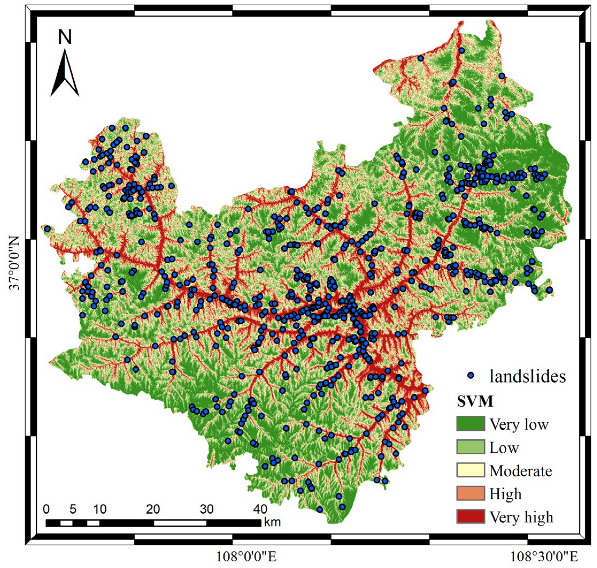

<div align="center">

<h1>An Efficient User-Friendly Integration Tool for Landslide Susceptibility Mapping Based on Support Vector Machines: SVM-LSM Toolbox</h1>

<div>
    <h3><strong>SVM-LSM Toolbox</strong></h3>
</div>

<div>
    <strong>Wubiao Huang</strong>, Mingtao Ding*, Zhenhong Li, Jianqi Zhuang, Jing Yang, Xinlong Li, Ling’en Meng, Hongyu Zhang, Yue Dong
</div>

<div>
    <h4 align="center">
        This repository is an official implementation of  <a href="https://doi.org/10.3390/rs14143408" target='_blank'>[Paper]</a> <a href="https://github.com/HuangWBill/SVM-LSM-Toolbox/blob/master/paper.pdf" target='_blank'>[PDF]</a>
    </h4>
</div>

</div>


___________

## Table of Contents
* [News](#News)
* [Abstract](#Abstract)
* [Toolbox_introduction](#Toolbox_introduction)
* [Installation_and_usage](#Installation_and_usage)
* [Case_and_results](#Case_and_results)
* [Citation](#Citation)
* [Contact](#Contact)
* [Notification](#Notification)
___________

## News
- [2024-10-17] Rewrite the readme.md and update Supplementary instructions(required reading).pdf based on user feedback.
- [2023-08-22] According to the feedback of users, Add Supplementary instructions (required reading).txt in manual folder. This .txt file can help users better use the toolbox.
- [2023-02-27] According to the feedback of "ValueError: invalid literal for int() with base 10:'0.' " error in the "Model Training and Performance Evaluation of SVM", "Landslide Susceptibility Map Prediction (Single process)" and "Landslide Susceptibility Map Prediction (Multiprocessing)" tool during the user's use, the toolbox was updated on February 27, 2023 to solve the above problems.
- [2022-07-20] The Toolbox have been released.
- [2022-07-14] The paper has been accepted by Remote Sensing (RS).

## Abstract
> *Landslide susceptibility mapping (LSM) is an important element of landslide risk assessment, but the process often needs to span multiple platforms and the operation process is complex. This paper develops an efficient user-friendly toolbox including the whole process of LSM, known as the SVM-LSM toolbox. The toolbox realizes landslide susceptibility mapping based on a support vector machine (SVM), which can be integrated into the ArcGIS or ArcGIS Pro platform. The toolbox includes three sub-toolboxes, namely: (1) influence factor production, (2) factor selection and dataset production, and (3) model training and prediction. Influence factor production provides automatic calculation of DEM-related topographic factors, converts line vector data to continuous raster factors, and performs rainfall data processing. Factor selection uses the Pearson correlation coefficient (PCC) to calculate the correlations between factors, and the information gain ratio (IGR) to calculate the contributions of different factors to landslide occurrence. Dataset sample production includes the automatic generation of non-landslide data, data sample production and dataset split. The accuracy, precision, recall, F1 value, receiver operating characteristic (ROC) and area under curve (AUC) are used to evaluate the prediction ability of the model. In addition, two methods (single processing and multiprocessing) are used to generate LSM. The prediction efficiency of multiprocessing is much higher than that of the single process. In order to verify the performance and accuracy of the toolbox, Wuqi County, Yan’an City, Shaanxi Province was selected as the test area to generate LSM. The results show that the AUC value of the model is 0.8107. At the same time, the multiprocessing prediction tool improves the efficiency of the susceptibility prediction process by about 60%. The experimental results confirm the accuracy and practicability of the proposed toolbox in LSM.*

## Toolbox_introduction
> Landslide susceptibility mapping (LSM) is an important part of landslide risk assessment, but the process often needs to span multiple platforms, and the operation process is complex. We develops an efficient user-friendly toolbox including the whole process of LSM: SVM-LSM toolbox.
>
> The toolbox realizes landslide susceptibility mapping based on a support vector machine (SVM), which can be integrated into ArcGIS 10.1 (or higher) or ArcGIS Pro platform. The toolbox includes three sub-toolboxes, namely:
> * *(1) influence factor production;*
> * *(2) dataset production and factor selection;*
> * *(3) model training and prediction.*
> 
> 
>
>Influence factor production provides automatic calculation of DEM-related topographic factors, convert line vector data to continuous raster factor, and rainfall data processing. Factor selection uses PCC to calculate the correlation between factors, and IGR to calculate the contribution of factors to landslide occurrence. Dataset sample production includes automatic generation of non-landslides data, data sample production, and dataset split. The accuracy, precision, recall, F1 value, receiver operating characteristic (ROC) and area under curve (AUC) were used to evaluate the prediction ability of the model. In addition, we provide two methods, single process and multiprocessing, to generate LSM. The prediction efficiency of multiprocessing is much higher than that of single process.

## Installation_and_usage
> The toolbox folder contains a .tbx format toolbox and two dist folders that necessary for the multiprocessing prediction tools to run.
> * The toolbox installation can be found in [Manual/Installation Instructions and Toolbox Introduction.pdf](./Manual/Installation_Instructions_and_Toolbox_Introduction.pdf)
> * The usage introduction can be found in [Manual/Usage Process (Case).pdf](./Manual/Usage_Process(Case).pdf)
> 
> #### The required reading file before use! [Manual/Supplementary instructions(required reading).pdf](./Manual/Supplementary_instructions(required_reading).pdf)
>> #### Recommended dependent software version: *ArcGIS 10.8 and ArcGIS Pro 2.5* 

## Case_and_results
> Wuqi County, Yan’an City, Shaanxi Province was selected as the test area to to verify the performance and accuracy of the toolbox.



> Table 1. Statistical analysis of each susceptibility class in Wuqi County.

| Classes   | Area (km<sup>2</sup>) | Proportion (%) | Landslide Density (Number/km<sup>2</sup>)|                                                                                                                                                                                                                                                                      
| :-------: | :-------------------: | :------------: | :--------------------------------------: |
| Very low  | 924.43                | 24.28          | 0.04                                     |
| Low       | 948.24                | 24.90          | 0.08                                     |
| Moderate  | 794.02                | 20.85          | 0.14                                     |
| High      | 648.42                | 17.03          | 0.28                                    |
| Very high | 439.02                | 12.94          | 0.77                                     |

> Table 2. Computation statistics of various tools with different software in Wuqi County.

| Tool   | ArcGIS | ArcGIS Pro |                                                                                                                                                                                                                                                                 
| :-------: | :-------------------: | :------------: |
| Topographic factor calculation  | 58 s   | 42 s   |
| Convert line vector data to continuous raster factor | 1 min 9 s   | 34 s   |
| Rainfall data processing  | 57 s    | 50 s   |
| Batch clipping of each factor layer | 18 s   | 17 s   |
| Non-landslide data generation | 2 s   | 1 s  |
| Data sample production* (landslide) | 5 min 22 s / 4 min 46 s   | 4 min 34 s / 4 min 29 s  |
| Data sample production* (non-landslide) | 4 min 56 s / 4 min 32 s   | 4 min 19 s / 4 min 15 s  |
| Dataset split* | 0.5 s / 0.5 s   | 0.5 s / 0.5 s  |
| PCC and IGR calculation | 1 min 16 s   | 57 s  |
| Image generation to be predicted* | 3 min 38 s / 2 min 45 s   | 1 min 32 s / 1 min 13 s  |
| Model training and performance evaluation of SVM | 1 h 55 min 32 s   | 1 h 8 min 8 s  |
| Landslide susceptibility map prediction(single process) | 2 h 53 min 15 s   | 1 h 26 min 47 s  |
| Landslide susceptibility map prediction(multiprocessing) | 21 min 51 s   | 20 min 12 s  |
| Total<sup>†</sup> | 5 h 19 min 27 s / 2 h 48 min 3 s   | 2 h 58 min 39 s / 1 h 52 min 4 s  |

Notes: “Data sample production”, “dataset split” and “image generation to be predicted” tools must be run twice. * indicates that the first run time and the second run time, and † shows the total single process running time and the total multiprocessing running time.

## Citation
Please kindly cite the papers if this code is useful and helpful for your research: 
```
@article{huang2022efficient,
  title = {An efficient user-friendly integration tool for landslide susceptibility mapping based on support vector machines: SVM-LSM toolbox},
  author = {Huang, Wubiao and Ding, Mingtao and Li, Zhenhong and Zhuang, Jianqi and Yang, Jing and Li, Xinlong and Meng, Ling’en and Zhang, Hongyu and Dong, Yue},
  journal = {Remote Sensing},
  volume = {14},
  number = {14},
  pages = {3408},
  year = {2022},
  DOI = {10.3390/rs14143408}
}
```

## Contact
If you have the problems related to the use of the toolbox with your usage, you can send an email to [Wubiao Huang](huangwubiao@chd.edu.cn).
If you have the problems related to obtain the dataset and code, you can contact the corresponding author [Mingtao Ding](mingtaiding@chd.edu.cn).

## Notification

> Hello, teachers and scholars!   
>    
> Due to the change of my research direction and other reasons, I may not maintain the SVM-LSM Toolbox in the near future. If you have some problems that cannot be solved, you can join the WeChat group below (the QR code is valid for 7 days) to communicate and learn from each other. We deeply apologize for not being able to reply to your emails in time! Wishing you all good luck in your research and good health!
>
> SVM-LSM Toolbox Developer
>
> 10th August 2023
> 
> 
