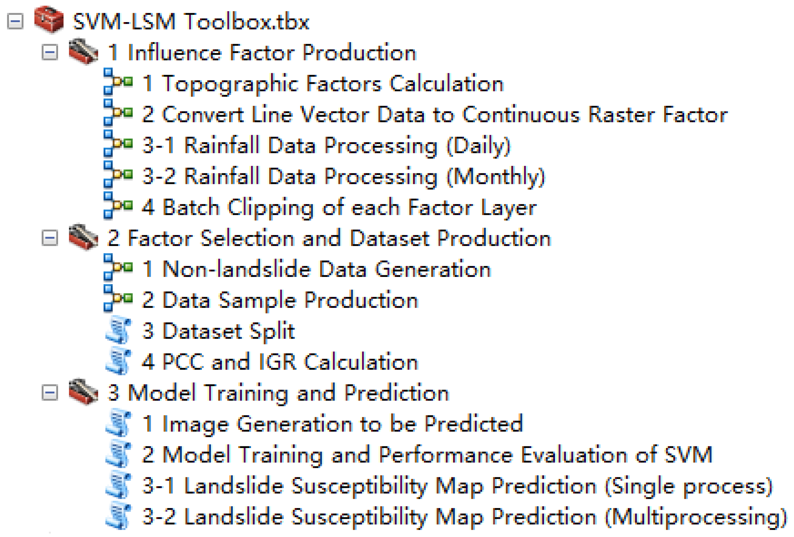

<div align="center">

<h1>一个基于支持向量机的滑坡易发性制图高效且用户友好型集成工具：SVM-LSM工具箱</h1>

<div>
    <h3><strong>SVM-LSM Toolbox</strong></h3>
</div>

<div>
    <strong>黄武彪</strong>, 丁明涛*, 李振洪, 庄建琦, 杨璟, 李鑫泷, 孟岭恩, 张宏宇, 董岳
</div>

<div>
    <h4 align="center">
        这是 <a href="https://doi.org/10.3390/rs14143408" target='_blank'>[Paper]</a> <a href="https://github.com/HuangWBill/SVM-LSM-Toolbox/blob/master/论文.pdf" target='_blank'>[PDF]</a>的中文版官方实现
    </h4>
</div>

</div>


___________

## 目录
* [更新](##更新)
* [摘要](##摘要)
* [工具箱介绍](##工具箱介绍)
* [安装和使用](##安装和使用)
* [案例与结果](##案例与结果)
* [引用](##引用)
* [联系](##联系)
* [通知](##通知)
___________

## 更新
- [2024-10-20] 重新撰写readme并根据用户反馈更新补充说明（必读）.pdf
- [2023-08-22] 根据用户反馈，在手册文件夹中添加补充说明（必读）.txt。这个.txt文件可以帮助用户更好地使用工具箱。
- [2023-02-27] 根据用户在使用“SVM模型训练和评估”、“滑坡易发性图预测（单进程）”和“滑坡易发性图预测（多进程）”工具时反馈的“ValueError:int（）的文本无效，基数为10:'0.'”错误，工具箱于2023年2月27日进行了更新，以解决上述问题。
- [2022-07-20] 工具箱开放获取。
- [2022-07-14] 论文被 Remote Sensing (RS) 接收。

## 摘要
> *滑坡易发性图（LSM）是滑坡风险评估的重要组成部分，但该过程通常需要跨越多个平台，操作过程复杂。本文开发了一个高效的用户友好的工具箱，包括LSM的整个过程，称为SVM-LSM工具箱。该工具箱基于支持向量机（SVM）实现了滑坡易发性制图，可以集成到ArcGIS或ArcGIS Pro平台中。工具箱包括三个子工具箱，即：（1）影响因子制作，（2）数据集制作和因子筛选，以及（3）模型训练及预测。影响因子生成提供DEM相关地形因子的自动计算，将线矢量数据转换为连续栅格因子，并执行降雨数据处理。因子选择使用皮尔逊相关系数（PCC）计算因子之间的相关性，使用信息增益比（IGR）计算不同因子对滑坡发生的贡献。数据集样本生成包括非滑坡数据自动生成、数据集制作与划分。准确度、精密度、召回率、F1值、受试者操作特征（ROC）和曲线下面积（AUC）用于评估模型的预测能力。此外，还使用两种方法（单进程和多进程）来生成LSM。多进程的预测效率远高于单进程。为了验证工具箱的性能和准确性，选择陕西省延安市吴起县作为生成LSM的试验区。结果表明，该模型的AUC值为0.8107。同时，多进程预测工具将预测过程的效率提高了约60%。实验结果证实了所提出的LSM工具箱的准确性和实用性。*
## 工具箱介绍
> 滑坡易发性制图是开展滑坡风险评估的重要内容，但该过程往往需要跨多个平台，过程繁琐。我们开发了一个包括LSM整个流程的快速的易于使用的用户友好型工具箱：SVM-LSM Toolbox。
>
> 该工具箱基于支持向量机实现滑坡易发性制图，可集成到ArcGIS或ArcGIS Pro中使用。该工具箱包括3个子工具箱，即：
> * *(1) 影响因子制作*
> * *(2) 数据集制作与因子筛选*
> * *(3) 模型训练及预测*
> 
> 
>
> 影响因子制作提供dem相关因子自动计算，线数据转连续型因子与降雨量数据处理。因子筛选使用PCC计算因子间的相关性，IGR计算因子对滑坡发生的贡献程度。数据集制作包括非滑坡数据自动生成，数据集制作与划分。模型精度评定使用总体精度、精确率、召回率、F1值、ROC曲线以及AUC值等指标。此外，在易发性图预测时，我们提供单进程与多进程两种方式，多进程的预测效率远高于单进程。

## 安装和使用
> 工具箱文件夹包含一个 .tbx 格式的工具箱和两个多进程预测工具运行必要的 dist 文件。
> * 工具箱安装教程可以在 [Manual/安装说明及工具箱介绍.pdf](./Manual/安装说明及工具箱介绍.pdf) 找到。
> * 使用说明可以在 [Manual/使用流程（案例）.pdf](./Manual/使用流程（案例）.pdf) 找到。
> 
> #### 使用之前必读！ [Manual/补充说明（必须阅读）.pdf](./Manual/补充说明（必须阅读）.pdf)
>> #### 推荐的以来软件版本: *ArcGIS 10.8 and ArcGIS Pro 2.5* 

## 案例和结果
> 以陕西省延安市吴起县为例去验证工具箱的性能。


> 表 1. 各易发性等级分区统计

| 分级   | 面积 (km<sup>2</sup>) | 比例 (%) | 滑坡密度 (个/km<sup>2</sup>)|                                                                                                                                                                                                                                                                      
| :-------: | :-------------------: | :------------: | :--------------------------------------: |
| 极低易发区  | 924.43                | 24.28          | 0.04                                     |
| 低易发区       | 948.24                | 24.90          | 0.08                                     |
| 中等易发区  | 794.02                | 20.85          | 0.14                                     |
| 高易发区      | 648.42                | 17.03          | 0.28                                    |
| 极高易发区 | 439.02                | 12.94          | 0.77                                     |

> 表 2. 各工具在不同软件下的运行时间统计

| 工具   | ArcGIS | ArcGIS Pro |                                                                                                                                                                                                                                                                 
| :-------: | :-------------------: | :------------: |
| DEM相关因子计算  | 58 s   | 42 s   |
| 线数据转连续型因子 | 1 min 9 s   | 34 s   |
| 降雨量数据处理  | 57 s    | 50 s   |
| 批量裁剪各因子层 | 18 s   | 17 s   |
| 非滑坡点数据生成 | 2 s   | 1 s  |
| 数据样本制作* (滑坡) | 5 min 22 s / 4 min 46 s   | 4 min 34 s / 4 min 29 s  |
| 数据样本制作* (非滑坡) | 4 min 56 s / 4 min 32 s   | 4 min 19 s / 4 min 15 s  |
| 数据集划分* | 0.5 s / 0.5 s   | 0.5 s / 0.5 s  |
| PCC与IGR计算 | 1 min 16 s   | 57 s  |
| 待预测影像生成* | 3 min 38 s / 2 min 45 s   | 1 min 32 s / 1 min 13 s  |
| SVM模型训练及精度评定 | 1 h 55 min 32 s   | 1 h 8 min 8 s  |
| 易发性图预测(单进程) | 2 h 53 min 15 s   | 1 h 26 min 47 s  |
| 易发性图预测(多进程) | 21 min 51 s   | 20 min 12 s  |
| 总计<sup>†</sup> | 5 h 19 min 27 s / 2 h 48 min 3 s   | 2 h 58 min 39 s / 1 h 52 min 4 s  |
注: “数据样本制作”, “数据集划分” 和 “待预测影像生成” 工具需运行两次。 * 表示第一次和第二次运行时间，†表示总体单进程运行时间和总体多进程运行时间 


## 引用
如果该工具箱或研究对您有帮助，请您按照如下方式进行引用：
```
@article{huang2022efficient,
  title = {An efficient user-friendly integration tool for landslide susceptibility mapping based on support vector machines: SVM-LSM toolbox},
  author = {Huang, Wubiao and Ding, Mingtao and Li, Zhenhong and Zhuang, Jianqi and Yang, Jing and Li, Xinlong and Meng, Ling’en and Zhang, Hongyu and Dong, Yue},
  journal = {Remote Sensing},
  volume = {14},
  number = {14},
  pages = {3408},
  year = {2022},
  DOI = {10.3390/rs14143408}
}
```

## 联系
如果您在工具箱使用过程中有问题，可以联系 [黄武彪](huangwubiao@chd.edu.cn).
如果您想获取数据集和代码，请联系通讯作者 [丁明涛](mingtaiding@chd.edu.cn).

## 通知

> 各位老师和同学：   
>    
> 由于研究方向变更及其他原因，该工具箱近期可能不会更新或更新维护不及时。如果您有问题，可以加入微信群互相交流学习。对于未能及时恢复的邮件深感抱歉！祝您科研顺利，身体健康！
>
> SVM-LSM Toolbox 开发者
>
> 2023年8月10日
> 
> 
