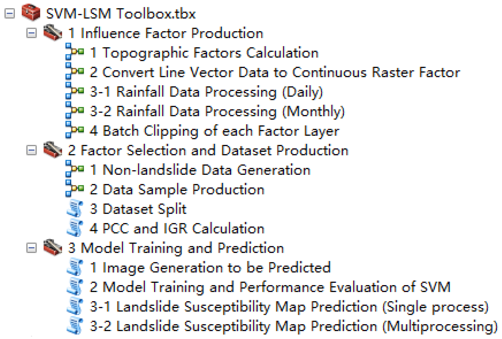

<div align="center">

<h1>SVM-LSM Toolbox</h1>

<div>
    <h3><strong>An Efficient User-Friendly Integration Tool for Landslide Susceptibility Mapping Based on Support Vector Machines: SVM-LSM Toolbox</strong></h3>
</div>

<div>
    <strong>Wubiao Huang</strong>, Mingtao Ding*, Zhenhong Li, Jianqi Zhuang, Jing Yang, Xinlong Li, Ling’en Meng, Hongyu Zhang, Yue Dong
</div>

<div>
    <h4 align="center">
        This repository is an official implementation of  <a href="https://doi.org/10.3390/rs14143408" target='_blank'>[Paper]</a> <a href="https://github.com/HuangWBill/SVM-LSM-Toolbox/blob/master/paper.pdf" target='_blank'>[PDF]</a>
    </h4>
</div>

</div>

      

<div>
<h3> </h3>
</div>

<div>
<h3> </h3>
</div>
  
<div>
    <h2 align="center">
        Abstract
    </h2>
</div>

*Landslide susceptibility mapping (LSM) is an important element of landslide risk assessment, but the process often needs to span multiple platforms and the operation process is complex. This paper develops an efficient user-friendly toolbox including the whole process of LSM, known as the SVM-LSM toolbox. The toolbox realizes landslide susceptibility mapping based on a support vector machine (SVM), which can be integrated into the ArcGIS or ArcGIS Pro platform. The toolbox includes three sub-toolboxes, namely: (1) influence factor production, (2) factor selection and dataset production, and (3) model training and prediction. Influence factor production provides automatic calculation of DEM-related topographic factors, converts line vector data to continuous raster factors, and performs rainfall data processing. Factor selection uses the Pearson correlation coefficient (PCC) to calculate the correlations between factors, and the information gain ratio (IGR) to calculate the contributions of different factors to landslide occurrence. Dataset sample production includes the automatic generation of non-landslide data, data sample production and dataset split. The accuracy, precision, recall, F1 value, receiver operating characteristic (ROC) and area under curve (AUC) are used to evaluate the prediction ability of the model. In addition, two methods (single processing and multiprocessing) are used to generate LSM. The prediction efficiency of multiprocessing is much higher than that of the single process. In order to verify the performance and accuracy of the toolbox, Wuqi County, Yan’an City, Shaanxi Province was selected as the test area to generate LSM. The results show that the AUC value of the model is 0.8107. At the same time, the multiprocessing prediction tool improves the efficiency of the susceptibility prediction process by about 60%. The experimental results confirm the accuracy and practicability of the proposed toolbox in LSM.*

<div>
    <h2 align="center">
        Toolbox_introduction
    </h2>
</div> 
The toolbox realizes landslide susceptibility mapping based on a support vector machine (SVM), which can be integrated into ArcGIS 10.1 (or higher) or ArcGIS Pro platform. The toolbox includes three sub-toolboxes, namely:

* *(1) influence factor production;*
* *(2) dataset production and factor selection;*
* *(3) model training and prediction.*



<div>

  
</div>

<div>
    <h2 align="center">
        Results
    </h2>
</div> 


Computation statistics of various tools with different software in Wuqi County.

| Tool   | ArcGIS | ArcGIS Pro |                                                                                                                                                                                                                                                                 
| :-------: | :-------------------: | :------------: |
| Topographic factor calculation  | 58 s   | 42 s   |
| Convert line vector data to continuous raster factor | 1 min 9 s   | 34 s   |
| Rainfall data processing  | 57 s    | 50 s   |
| Batch clipping of each factor layer | 18 s   | 17 s   |
| Non-landslide data generation | 2 s   | 1 s  |
| Data sample production* (landslide) | 5 min 22 s / 4 min 46 s   | 4 min 34 s / 4 min 29 s  |
| Data sample production* (non-landslide) | 4 min 56 s / 4 min 32 s   | 4 min 19 s / 4 min 15 s  |
| Dataset split* | 0.5 s / 0.5 s   | 0.5 s / 0.5 s  |
| PCC and IGR calculation | 1 min 16 s   | 57 s  |
| Image generation to be predicted* | 3 min 38 s / 2 min 45 s   | 1 min 32 s / 1 min 13 s  |
| Model training and performance evaluation of SVM | 1 h 55 min 32 s   | 1 h 8 min 8 s  |
| Landslide susceptibility map prediction(single process) | 2 h 53 min 15 s   | 1 h 26 min 47 s  |
| Landslide susceptibility map prediction(multiprocessing) | 21 min 51 s   | 20 min 12 s  |
| Total<sup>†</sup> | 5 h 19 min 27 s / 2 h 48 min 3 s   | 2 h 58 min 39 s / 1 h 52 min 4 s  |

Notes: “Data sample production”, “dataset split” and “image generation to be predicted” tools must be run twice. * indicates that the first run time and the second run time, and † shows the total single process running time and the total multiprocessing running time.


## 🚀 Get the Code

We'd love to hear your feedback before you download! Please click the button below to complete a quick survey and get immediate access to the source code. 

[Survey](https://your-microsoft-form-link-here)

## 🚀 BibTeX
```
@article{huang2022efficient,
  title = {An efficient user-friendly integration tool for landslide susceptibility mapping based on support vector machines: SVM-LSM toolbox},
  author = {Huang, Wubiao and Ding, Mingtao and Li, Zhenhong and Zhuang, Jianqi and Yang, Jing and Li, Xinlong and Meng, Ling’en and Zhang, Hongyu and Dong, Yue},
  journal = {Remote Sensing},
  volume = {14},
  number = {14},
  pages = {3408},
  year = {2022},
  DOI = {10.3390/rs14143408}
}
```
